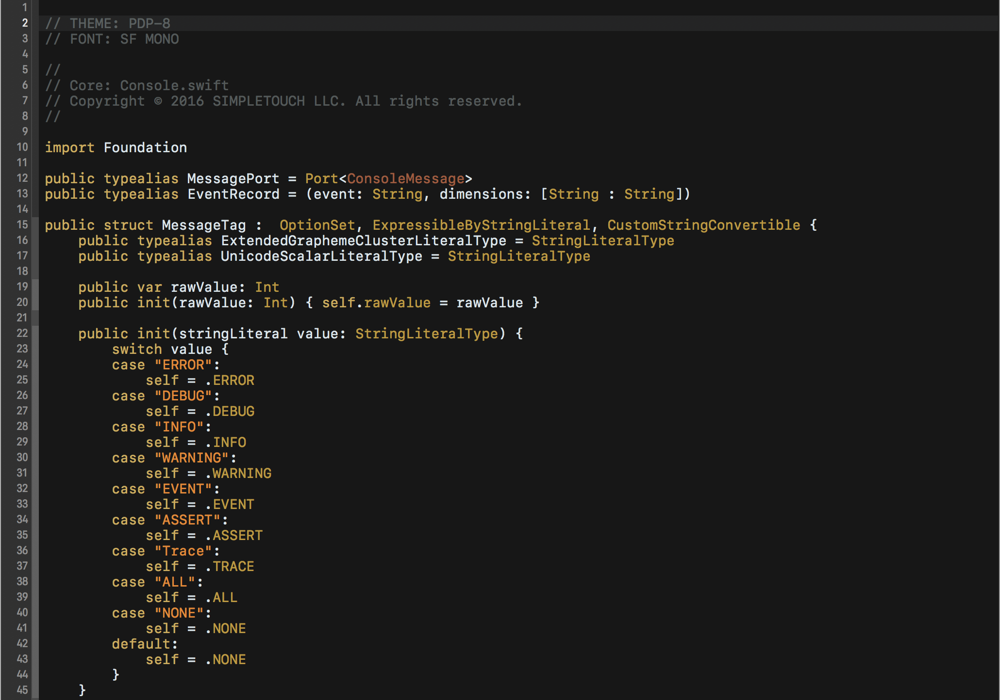
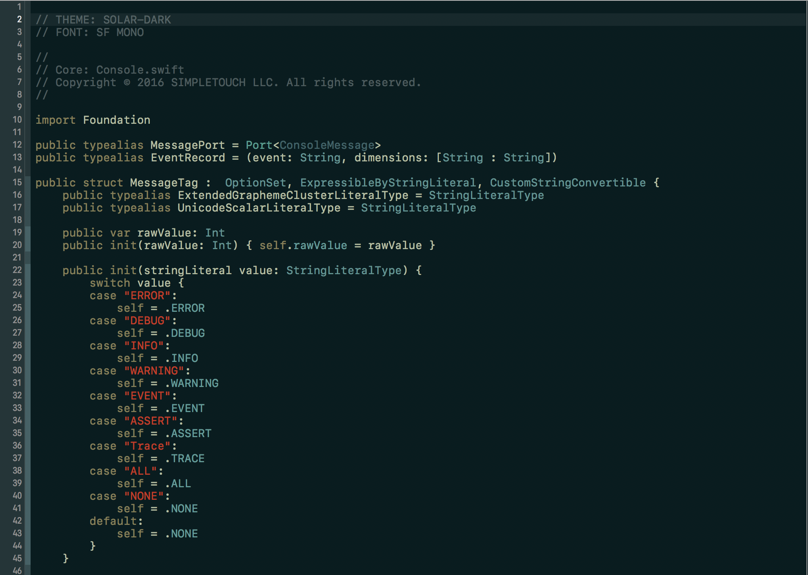
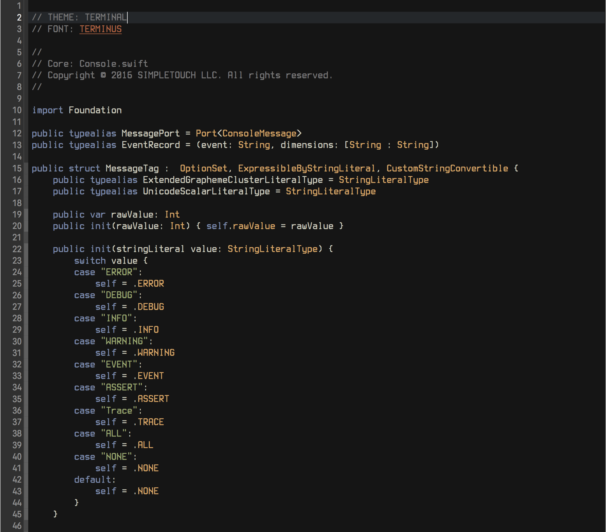
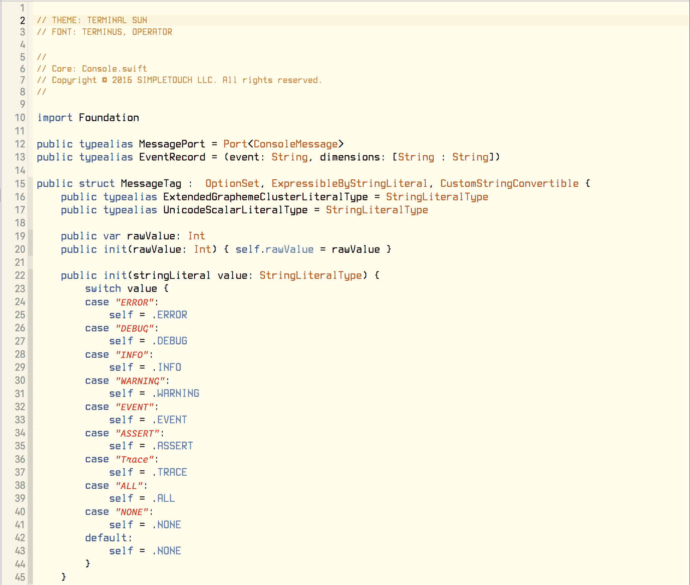
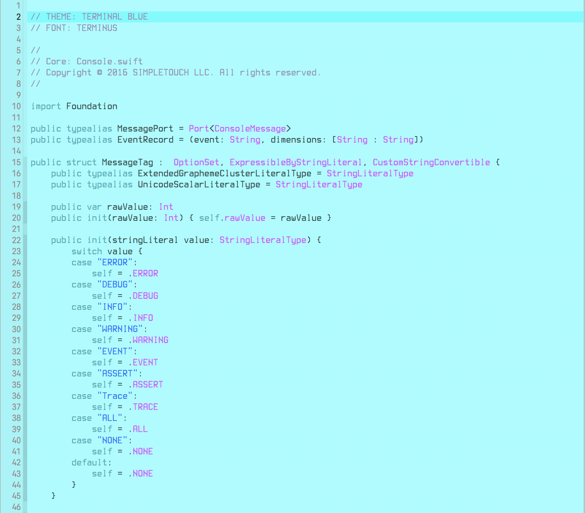
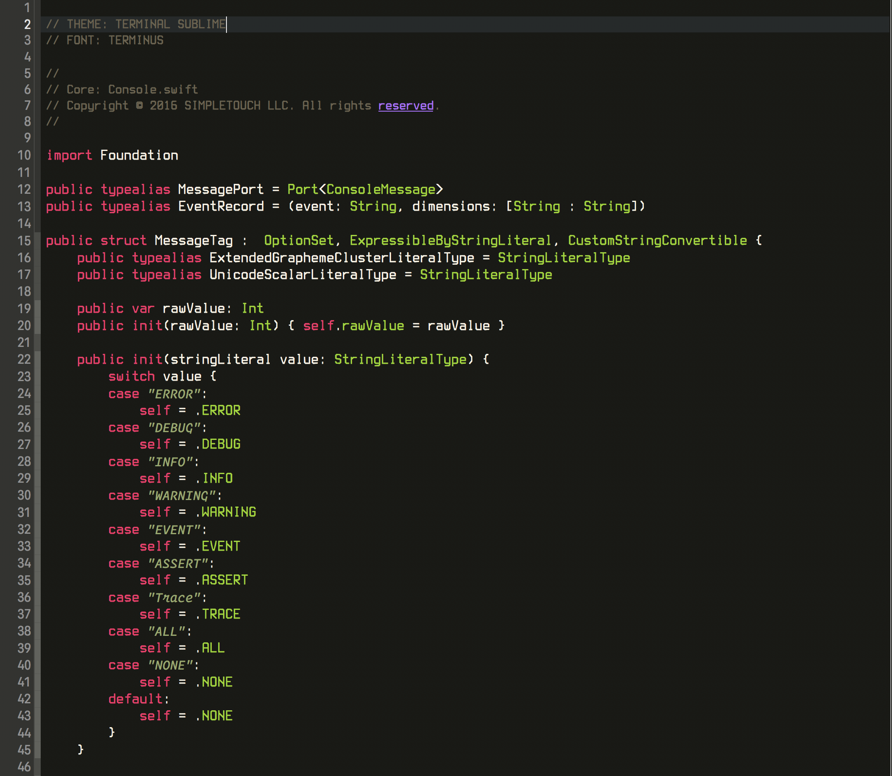

# xcode-themes
Custom themes for Xcode

Add the theme files to the `~/Library/Developer/Xcode/UserData/FontAndColorThemes` folder

### Fonts used
- SF Mono (provided with Xcode)
- [Operator](http://www.typography.com/fonts/operator/overview/)
- [Terminus](http://terminus-font.sourceforge.net/)

## PDP-8
Font: SF Mono
inspired by the PDP-8 Computer

## Solar Dark
Font SF Mono

## Terminal
Font: Terminus
inspired by jellybeans.vim

## Terminal Sun
Fonts: Terminus, Operator
modified Xcode Sunset

## Terminal Blue
Font: Terminus

## Terminal Sublime
Font: Terminus
inspired by Sublime

